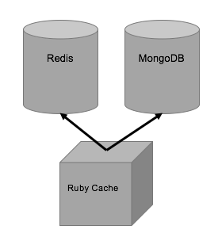

# Testing Docker features with a Redis Key-Value Cache

## An Example Architecture

For our Docker test I choosed to implement a Key-Value Data Proxy based in Redis, MongoDB and Ruby.

Figure 1 presents the architecture.

Figure 1. Cache Architecture

## Creating Docker Images and Containers

Docker indroduces the concept of Images, Containers and Docker Files.
To define a container you tipically use a base image and specifiy further configuration and network settings in a Docker file. You use this Docker file to create a new image that can be run (you create an instance of the image) in Docker.

In the case of Redis and Mongo we used the oficial images availble at Docker-hub. You can find the images and the documentation here:

- Redis Image
- MongoDB Image

To run the images, we use the following command:

/code here

In the case of Ruby, 

## Docker Compose

Testing Docker Compose allows to deploy an infraestructe definition in the local Docker service.

<IMPLEMENT>

## Performance Measurement

### Metrics

### Profiling

## Redis LRU Proxy
Redis LRU parameter was implemented and tested like the the following arcticle: <a ref="https://redis.io/topics/lru-cache">Redis lru-cache</a>.

Picture 2 shows the initial state of the Mongo collection. Pixels at the lower part of the image were written before (older data) than pixels upper part of the image (newer data).

Picture 2. Redis initial collection state

Picture 3. Redis discarding older samples using LRU algorithm

Picture 3 shows the performance of Redis LRU algorithm which replicates the results published in the following link <link>.

# Visualizing Services

Visutalizing a services system and it's data interdependencies can become a complex task quickly. In this example I explored <tool here>.

Figure 4 shows <continue>

# Apendix A: Testing and Documenting with RSpec and RDoc

# Aprendix B: Docker usesful commands

## End
##Some Ideas
-optimized for reads
-writes are slow becasue they write both, Redis and Mongo. A further work would be to store Mongo Writes in a Queue in redis (LPush, RPop)and let them happen at their on pace. In that schema writes always should write Redis. What happens if by chance data expires in Redis while not written in Mongo?
-How do I test? Can I force expiration of data before killing my laptop? I 
##The objective
This is an experimental and eclectic development with the following objectives:

- To explore the problems that arrise in a Microservice/Application container environments.
- To gain familiarity with the following technologies:
 - Docker
 - Docker-Compose
 - NodeJS
 - Ruby
 - Redis
 - MongoDB
 - MySql
- To experiment, to learn and to provide quantificable benchmarks about the chosen approaches and technologies.
- New Gadgets: Automated Documentation. Benhcmarking

##The problem
To work arround Docker and Microservices I have chosen to implement a Web Document Storage. The Web Storage will implemment a Web Restful API that clients will access, a persistent data storage and a in-memory cache to make reads faster.

Figure 1. shows our architecture. It will our playground to test techonologies and to benchmark performance.

We will implement two identical Web API containers, one developed in Ruby and another one in NodeJS. Their functionality and exposed interfaces will be identical.

an In-Memory Cache will be implemented with Redis. The Web-API will look for data first in Redis. If not found the Web-API will look in the persistant data storage.

For the persistant data storage we will test to different databases, MySql as a relational SQL like repository and MongoDB as a NonSql database.

We will debise a routing configuration that will tell our sistem when to use the Cache (Redis) and what persistent storage to use (MySql or MongoDB).

Regarding the algorithm for populating our Redis Cache, we will start simple. <describe>

##Developing the Application

### Creaing the Docker Images
#### Redis
#### MongoDb
#### MySQL

### The Ruby Proxy
### The NodeJs Proxy

### Docker-Compose

##Testing

## Benchmarking

## Conlusions

The problem chosen as our sandbox is this implemtation of a Web Document Storage. 
Clients face a Restful Web API interface and query for documents.
The proxy checks if 

##References:

<a url="https://docs.docker.com/engine/userguide/eng-image/dockerfile_best-practices/">https://docs.docker.com/engine/userguide/eng-image/dockerfile_best-practices/</a>

Redis demo based on:

<a url="https://medium.com/node-js-tips-tricks/implementing-a-job-queue-with-node-js-ffcfbc824b01#.bu5l9hqd4">https://medium.com/node-js-tips-tricks/implementing-a-job-queue-with-node-js-ffcfbc824b01#.bu5l9hqd4</a>

More links:

https://redis.io/topics/lru-cache
